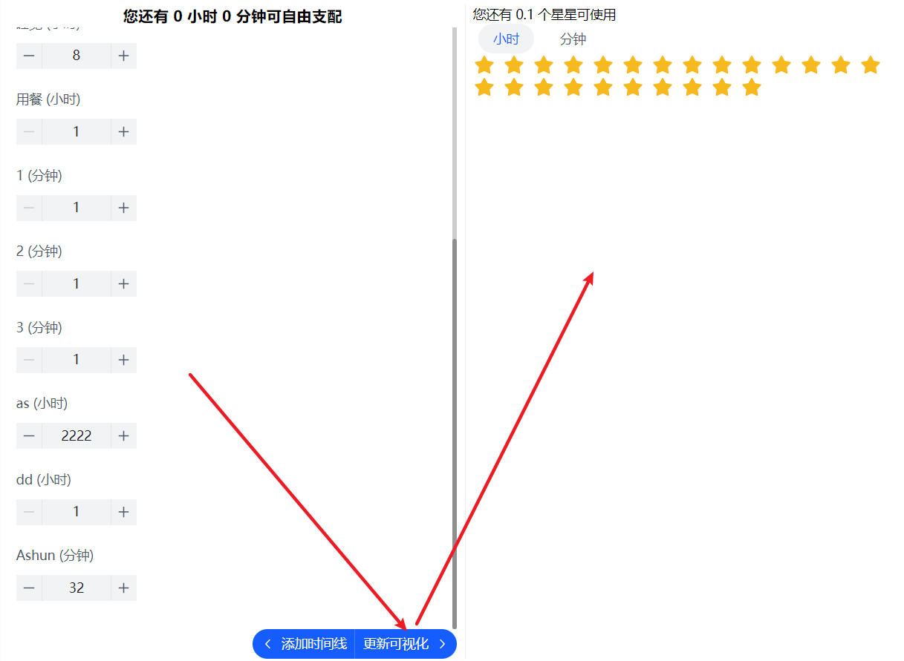

## 页面简稿


## Store

### dayTimeLine

* id：使用 nanoId 库生成
* value：object

示例

```
{
	"xxxdi":{
		name:"工作",
		weight:8,
		unit: "hour",
	}
}
```

## TODO

### 未完成功能

* 将左侧表单使用 Form 维护，这样点击 更新可视化 按钮时，就能拿到编辑后的数据

  

* 然后判断编辑后的数据是否超过时间阈值，来决定是否更新 store，并给用户反馈


## 待优化

### 轻微BUG

1.可使用星星数目，在切换为 `小时` tab 的时候，数值精度问题会导致显示数目错误


2.除了第一次添加时间线成功后，只弹出一次 Message，之后每次添加成功都会弹出两次 Message（与状态更新有关，更新多次）

## 样式

1. 时间线表单布局（每行两列）
2. 添加时间线Modal的表单布局（时间、单位处于一行）
3. 整体细节调整